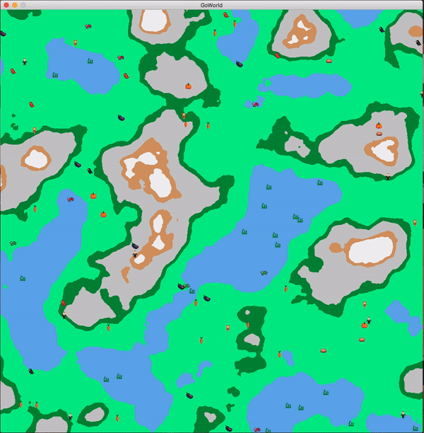

<p align="center"></p>
<i>Simulate beings walking, eating, drinking and mating on randomly generated terrain. </i>

# GoWorld 



This repository is meant to work as a *simple* simulation of life. Multiple beings can move around the surface and try to survive. It is not a perfect simulation and not many (if any) laws of nature are implemented. Still a fun little project to showcase the capabilities of go.

The terrain generation is done using [Perlin noise](https://flafla2.github.io/2014/08/09/perlinnoise.html), the movement is based on [Brownian motion](https://en.wikipedia.org/wiki/Brownian_motion). Everything else is pretty much randomly generated or chosen.

## Dependencies
+ [ebiten](https://ebiten.org) ... a simple game library

## Installation

#### Requirements:
+ Go 1.12 or later (ebiten requirement)
+ dep

#### Usage
Get the code:
```sh
go get -u github.com/rubinda/GoWorld
```
Get the dependencies:
```sh
cd $GOPATH/src/github.com/rubinda/GoWorld
dep ensure
```
Then, you can choose to either install to `GOBIN`:
```sh
go install cmd/goworld/goworld.go
goworld
```
... or build in the source folder:
```sh
go build -o GoWorld cmd/goworld/goworld.go
./GoWorld
```
> Note: the last two commands (install or build) assume that you are positined at the root folder of this repository and
> that the appropriate tools and packages are installed. On macOS High Sierra nothing additional was needed, but in case 
> of Ubuntu 20.04 `xorg-dev` and `libgl1-mesa-dev` were required)

## License 

See [LICENSE.md](LICENSE.md)
